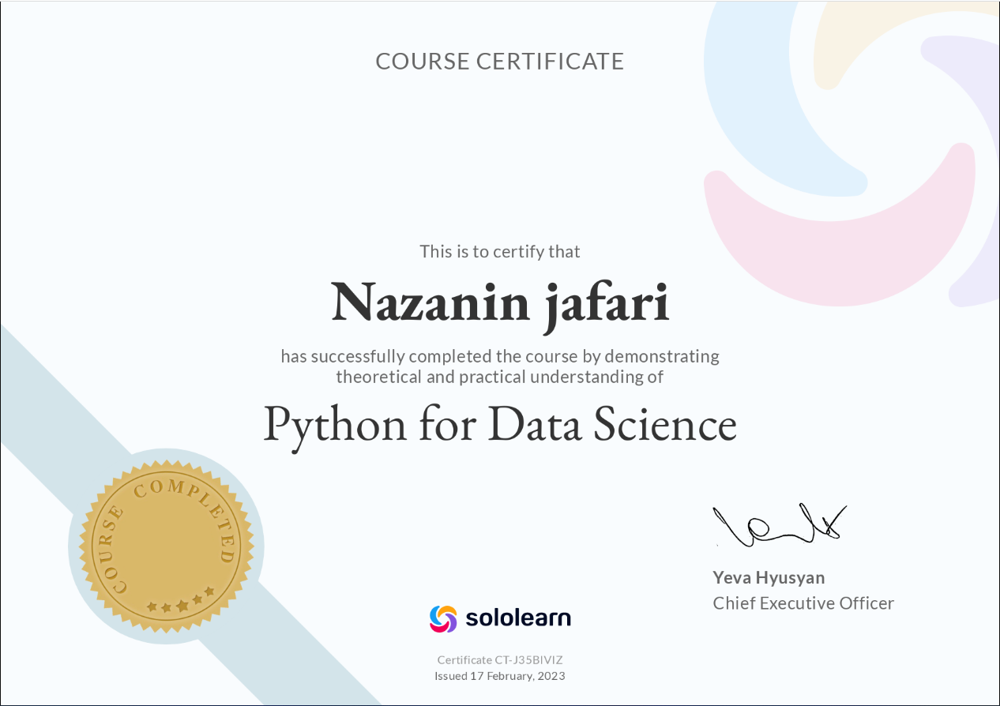

# MachineLearning_1
Data Science

Tout d'abord, je suis excité pour passer les cours de Data Science sur le site Sololearn, et voilà mon certificat!

---
## ballon & banana

celui-ci ,il s'agit d' un ensemble de données de ballon et melon dont j'ai fourni sans méthode(au hasard) avec bibliothèque très efficace de Numpy, Matplotlib et Pandas.

